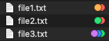

# Tag list

Dead simple utility to extract mac-os file tags as JSON data.

## Build

```sh
clang -framework Foundation src/tag-list/main.m -o /tmp/tag-list
```

## Install

```sh
mv /tmp/tag-list /usr/local/bin/
```

## Usage example

Basic usage is providing file path list directly as arguments



```sh
tag-list file1.txt file2.txt file3.txt  # ...
```

```json
{
  "data" : [
    {
      "path" : "file1.txt",
      "tags" : ["Red", "Orange"]
    },
    {
      "path" : "file2.txt",
      "tags" : ["Red", "Green"]
    },
    {
      "path" : "file3.txt",
      "tags" : ["Red", "Green", "Blue", "Purple"]
    }
  ]
}
```

Useful usage could be case with passing result of `find`

```sh
find ~/Documents/ -type f -iname '*.txt' -print0 | xargs -0 tag-list
```

## Contribution

codestyle:

```sh
# brew install clang-format
clang-format src/tag-list/main.m -i --style="{BasedOnStyle: Google, IndentWidth: 4}"
```

## [Changelog](changelog.md)
## [License (MIT)](license.md)
